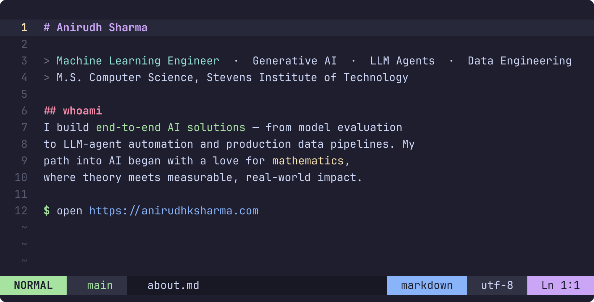

 

### Certifications

---

### Tech Stack

**Languages** &nbsp;

**ML & Data** &nbsp;

**Infra** &nbsp;

Also: Model Context Protocol (MCP) &middot; Streamlit &middot; Azure Data Factory &middot; Proxmox &middot; Power BI &middot; Selenium/Scrapy

---

### Featured Projects

**FraudSight AI** &mdash; Agentic Fraud Detection &middot; *Stevens Institute of Technology*
End-to-end tool that analyzes images and PDFs for AI-generated artifacts and document forgeries through a 3-stage agentic pipeline on a FastAPI backend. A high-precision Vision Agent runs digital forensics (physics failures, "melting" structures, font inconsistencies); a Multi-Model Critic Voting layer aggregates independent verdicts from Qwen-VL-Plus, DeepSeek R1, and GLM 4.6 &mdash; reaching **72% accuracy** on real-world data. Dynamic Media Routing cut API token cost **50-75%**.

**Jaguar Re-Identification Challenge** &mdash; Kaggle *(ongoing)*
Computer-vision + metric-learning pipeline to re-identify individual jaguars across camera-trap images for wildlife conservation. Engineering invariant feature embeddings with PyTorch CNNs, robust to lighting, pose, and occlusion.

**Diabetic Retinopathy Severity Classification** &mdash; *Stevens Institute of Technology*
Processed **143K retinal fundus images (~22 GB)** and built an EfficientNet-B0 classifier at **87% balanced accuracy**. Added a distributed Random Forest baseline in PySpark across a 1-master + 3-worker cluster, cutting end-to-end training time **52%**.

**[Adversarial Attacks on Neural Networks](https://github.com/anirudhksharma/Adverseral_Attacks_on_Neural_Net)** &mdash; *Stevens Institute of Technology*
Implemented FGSM attacks on CIFAR-10, quantifying a baseline CNN's collapse (78.6% clean to ~2.3% at eps=0.01). Trained a robust model via min-max adversarial training (eps=0.001: 55.2% vs 43.3%) with reproducible PyTorch experiments.

Open source: <a href="https://github.com/anirudhksharma/codebase-memory-mcp">codebase-memory-mcp</a> &middot; <a href="https://github.com/anirudhksharma/multimodal-fraud-detector">multimodal-fraud-detector</a> &middot; <a href="https://github.com/anirudhksharma/tip-protocol">tip-protocol</a>

---

### Experience

**CRM Developer** &middot; Scattering Resources (Nonprofit) &mdash; *Jun 2026 - Present*
Built LLM-agent automations with the Model Context Protocol (MCP) orchestrating CRM workflows in GoHighLevel, used Chrome DevTools Protocol browser automation for tasks the vendor's read-only API doesn't expose, and shipped automated email-campaign workflows replacing manual outreach.

**Graduate Researcher** &middot; Stevens Institute of Technology &mdash; *Jan 2026 - May 2026*
Researched LLM agent reliability on ShoppingBench ([arXiv:2508.04266](https://arxiv.org/abs/2508.04266)), a 2.5M-product Lucene search sandbox. Raised Qwen-2.5-72B's format score **0.47 to 0.72** in a controlled A/B benchmark over OpenRouter; a three-way ablation showed strict typed tool schemas eliminated **100% of parameter hallucinations** (0.72 to 0.80). Shipped an interactive Streamlit app for real-time tool-calling evaluation.

**Data Engineer Intern** &middot; Addend Analytics &mdash; *Dec 2022 - Jan 2023*
Designed ETL workflows on Azure (Azure Data Factory + PySpark) ingesting API data into SQL tables, optimized with incremental-load techniques, and automated error notifications via Azure Logic Apps.

---

### Education

- **M.S. Computer Science** &mdash; Stevens Institute of Technology, Hoboken NJ &middot; *2024-2026*
  Machine Learning &middot; Deep Learning &middot; Big Data &middot; NLP &middot; Generative AI
- **B.E. Computer Science** &mdash; University of Mumbai &middot; *2020-2024*

---

